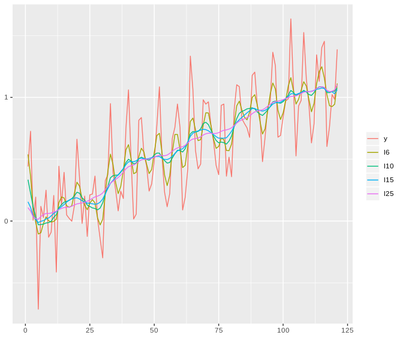

# CreepyTrend

Fast and object oriented implementation of method based on moving trend algorithm using C++ and RcppArmadillo.
Actually in intensive developing.

<br><br>

## Simple usage for smoothing time series

###Installation

``` r
remotes::install_github("pawelkasperkiewicz/CreepyTrend", type = "source", dependencies = T)
```

###Usage

Create example time series with some seasonality and randomness

``` r
library(CreepyTrend)

set.seed(666)
data <- data.table(
  x = seq.Date(as.Date("2000-01-01"), as.Date("2010-01-01"), "month"),
  y = sin(1:121)/3 + rnorm(121)/5 + (1:121)/100
  )
```

Initialize CreepyTrend object

``` r
R <- CreepyTrend$new(x = data$y)
```

Create four series with smoothed values of empirical data

``` r
R$fit(l = c(6, 10, 15, 25))
```

After call $fit() we obtain data.table with empirical data and smoothed versions

``` r
R$smoothed

#     x            y          l6         l10         l15        l25
#  1:   1  0.441152538  0.53886141  0.33445173  0.15535809 0.10845913
#  2:   2  0.725970075  0.36227355  0.22581997  0.11014984 0.08015853
#  3:   3  0.006013111  0.10466922  0.11520446  0.04007678 0.03389861
#  4:   4  0.193366070 -0.01203058  0.03410502  0.01224359 0.01933931
#  5:   5 -0.713016315 -0.10499548 -0.02995859 -0.01174774 0.01343275
# ---                                                                
#117: 117  0.602510547  1.02230509  1.03887356  1.04817813 1.05726390
#118: 118  0.762824435  0.93287244  1.03857490  1.04741800 1.04645039
#119: 119  1.022634923  0.92551123  1.04837708  1.04472069 1.04991371
#120: 120  0.983514687  0.94449100  1.05065722  1.02960815 1.06065932
#121: 121  1.388200468  1.11244286  1.07636802  1.06300911 1.10447599
```

<br>

Let's visualize it using $plot() method to check what level of smoothing is satisfying

``` r
R$plot()
```



<br>

We can visualise our empirical and smoothed series with interactive mode using plotly. It is very useful when we have couple of smoothed series

``` r
R$plot(interactive = T)
```

When you create plot with plotly, you can hide or show selected smoothed series just clicking on it in legend section

<br>

While $plot is ggplot2 object, you can edit it with ggplot functions, like theme()

``` r
R$plot() + ggtitle("Smoothed time series") + theme(plot.title = element_text(hjust = 0.5))
```


